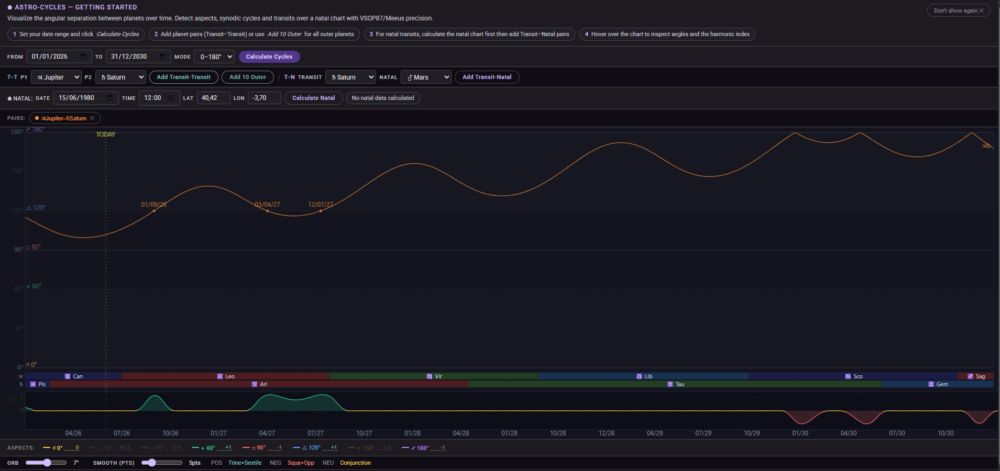

# 🌌 Astro-Cycles

🔭 **[Live Demo](https://fransolerc.github.io/astro-cycles)** · Astronomical cycle calculator and visualizer · VSOP87/Meeus precision



---

[**Español**](#-español) | [**English**](#-english)

---

## 🇺🇸 English

Astro-Cycles visualizes the angular separation between planets over time. Detect conjunctions, oppositions and other aspects, track synodic cycles, and overlay a harmonic index — all in the browser, no server required.

### ✨ Features

- **Transit–Transit (T-T):** Angular separation between any two planets across a date range.
- **Transit–Natal (T-N):** Transits against a custom birth chart.
- **Harmonic Index:** Configurable scoring of global tension/harmony based on active aspects and orbs.
- **Sign Timeline:** Color-coded band showing which zodiac sign each planet occupies, with element grouping (Fire/Earth/Air/Water).
- **Interactive Tooltip:** Hover or touch to inspect angles, sign positions, and the harmonic index at any point in time.
- **Highly Configurable:** Adjust orbs, smoothing, display mode (0–180° / 0–360°), and aspect weights.
- **Mobile Optimized:** Responsive layout with touch support.

### 🛠️ Stack

Vanilla JavaScript (ES6+) · HTML5 Canvas · CSS3 — no frameworks, no build step, no dependencies.

Astronomy engine based on VSOP87 orbital elements and Meeus algorithms.

### ⚙️ Setup

Static app — no server needed:

```
git clone https://github.com/fransolerc/astro-cycles
open index.html
```

Or use the **[Live Demo](https://fransolerc.github.io/astro-cycles)** directly.

---

## 🇪🇸 Español

Astro-Cycles visualiza la separación angular entre planetas a lo largo del tiempo. Detecta conjunciones, oposiciones y otros aspectos, sigue ciclos sinódicos y superpone un índice armónico — todo en el navegador, sin servidor.

### ✨ Características

- **Tránsitos Planetarios (T-T):** Separación angular entre cualquier par de planetas en un rango de fechas.
- **Tránsitos Natales (T-N):** Tránsitos sobre una carta natal personalizada.
- **Índice Armónico:** Puntuación configurable de tensión/armonía global basada en aspectos activos y orbes.
- **Timeline de Signos:** Banda con código de color mostrando en qué signo se encuentra cada planeta, agrupado por elemento (Fuego/Tierra/Aire/Agua).
- **Tooltip Interactivo:** Hover o toque para inspeccionar ángulos, posiciones en signo e índice armónico en cualquier punto temporal.
- **Altamente Configurable:** Ajuste de orbes, suavizado, modo de visualización (0–180° / 0–360°) y pesos de aspecto.
- **Optimizado para Móvil:** Interfaz adaptativa con soporte táctil.

### 🛠️ Stack

Vanilla JavaScript (ES6+) · HTML5 Canvas · CSS3 — sin frameworks, sin build step, sin dependencias.

Motor astronómico basado en elementos orbitales VSOP87 y algoritmos de Meeus.

### ⚙️ Ejecución

Aplicación estática — no requiere servidor:

```
git clone https://github.com/fransolerc/astro-cycles
open index.html
```

O usa la **[Demo en Vivo](https://fransolerc.github.io/astro-cycles)** directamente.
